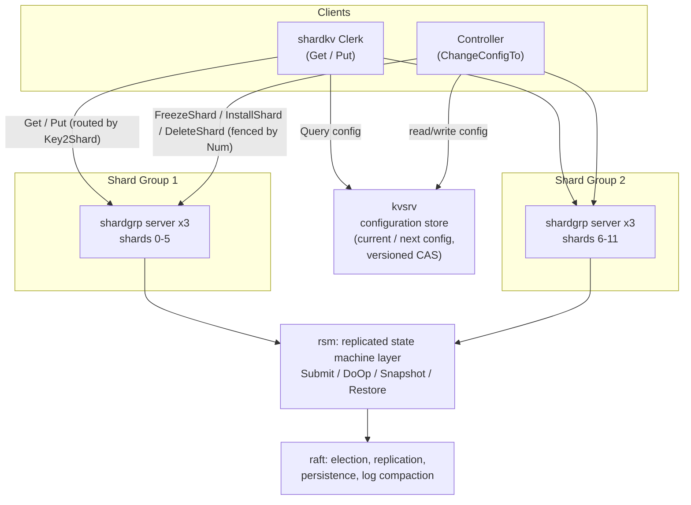

# Raft - Distributed Key/Value Store

A fault-tolerant, linearizable, sharded key/value storage system built from scratch in Go, on top of a from-scratch implementation of the [Raft consensus protocol](https://raft.github.io/raft.pdf).

The system spans the full stack of a modern replicated datastore: leader election and log replication, crash-recoverable persistence, log compaction via snapshotting, a reusable replicated-state-machine abstraction, exactly-once client semantics, and a sharded deployment with online reconfiguration driven by a fault-tolerant controller. A distributed MapReduce engine with worker fault tolerance is also included.

Every component is validated by an automated fault-injection test suite (117 tests) that runs under the Go race detector and subjects the system to dropped and reordered messages, network partitions, server crashes and restarts, and concurrent clients — with linearizability verified by the [Porcupine](https://github.com/anishathalye/porcupine) model checker.

Developed against the MIT 6.5840 (Distributed Systems) lab specifications.

---

## Table of Contents

- [Architecture](#architecture)
- [Repository Layout](#repository-layout)
- [Components](#components)
  - [1. Raft Consensus (`raft1`)](#1-raft-consensus-raft1)
  - [2. Replicated State Machine (`kvraft1/rsm`)](#2-replicated-state-machine-kvraft1rsm)
  - [3. Single-Node KV Server and Distributed Lock (`kvsrv1`)](#3-single-node-kv-server-and-distributed-lock-kvsrv1)
  - [4. Fault-Tolerant KV Service (`kvraft1`)](#4-fault-tolerant-kv-service-kvraft1)
  - [5. Sharded KV Service (`shardkv1`)](#5-sharded-kv-service-shardkv1)
  - [6. Distributed MapReduce (`mr`)](#6-distributed-mapreduce-mr)
- [Extension: Exactly-Once `Put`](#extension-exactly-once-put)
- [Building and Testing](#building-and-testing)
- [Testing Methodology](#testing-methodology)
- [Design Notes and Trade-offs](#design-notes-and-trade-offs)

---

## Architecture



The layering is strictly bottom-up, and each layer is independently testable:

| Layer | Responsibility | Guarantee provided |
| --- | --- | --- |
| `raft1` | Consensus over a replicated log | Totally-ordered, durable, majority-committed log |
| `kvraft1/rsm` | Request/commit matching, snapshot policy | Service-agnostic replicated state machine |
| `kvraft1` / `shardkv1/shardgrp` | Key/value state machine | Linearizable, exactly-once `Put` |
| `shardkv1/shardctrler` | Shard-to-group assignment | Safe online reconfiguration, at most one owner per shard |
| `shardkv1` Clerk | Routing and retry | Transparent shard migration for the application |

---

## Repository Layout

```
src/
├── raft1/                   Raft consensus implementation
├── raftapi/                 Raft interface exposed to services (ApplyMsg, Raft)
├── kvraft1/
│   ├── rsm/                 Reusable replicated-state-machine layer over Raft
│   ├── server.go            Replicated KV state machine (DoOp/Snapshot/Restore)
│   └── client.go            Leader-tracking, deduplicating Clerk
├── kvsrv1/
│   ├── server.go            Single-node versioned KV server
│   ├── client.go            Retrying Clerk with request deduplication
│   ├── lock/                Distributed lock built on conditional put
│   └── rpc/                 Shared RPC types and error codes
├── shardkv1/
│   ├── client.go            Sharded Clerk: config lookup, routing, retry
│   ├── shardcfg/            Configuration representation, Key2Shard hashing
│   ├── shardctrler/         Controller: InitConfig, Query, ChangeConfigTo, recovery
│   └── shardgrp/            Per-group replicated server + clerk + shard RPCs
├── mr/                      Distributed MapReduce coordinator and worker
├── mrapps/                  MapReduce applications (wc, indexer, crash, ...)
├── labrpc/                  Simulated lossy/reordering RPC transport
├── labgob/                  Gob wrapper with capitalization diagnostics
├── kvtest1/                 KV test harness + Porcupine linearizability checking
├── models1/                 Porcupine operational model for the KV service
├── tester1/                 Cluster harness: partitions, crashes, annotations
└── main/                    Standalone daemon entry points
```

---

## Components

### 1. Raft Consensus (`raft1`)

A complete implementation of the extended Raft paper's Figure 2, plus Section 7 log compaction.

**Leader election**
- Randomized election timeouts in `[300, 600)` ms with a jittered ticker, preventing repeated split votes.
- `RequestVote` enforces the §5.4.1 election restriction: a vote is granted only if the candidate's log is at least as up to date (higher last term, or equal term and no shorter) as the voter's.
- Term-based demotion is applied uniformly on every RPC path — any observed higher term causes an immediate step-down to follower, reset of `votedFor`, and a persist.
- On winning, the leader initializes `nextIndex`/`matchIndex` and launches a heartbeat goroutine.

**Log replication**
- `Start()` appends to the leader's log and immediately nudges the heartbeat goroutine over a buffered channel, so a new command is replicated without waiting out the 100 ms heartbeat interval — a latency optimization over pure periodic replication.
- `AppendEntries` implements the full consistency check: reject on `prevLogIndex`/`prevLogTerm` mismatch, truncate conflicting suffixes, append only genuinely new entries, and advance `commitIndex` to `min(leaderCommit, lastLogIndex)`.
- Commitment advances only for entries replicated to a majority **in the leader's current term**, closing the Figure 8 anomaly in which an entry replicated on a majority can still be overwritten.
- **Fast log backtracking:** rejections carry `XTerm` (term of the conflicting entry), `XIndex` (first index of that term), and `XLen` (follower log length), letting the leader skip a whole conflicting term per round trip instead of decrementing `nextIndex` one entry at a time. This is what makes the divergent-log recovery tests complete in seconds rather than timing out.
- A dedicated applier goroutine delivers committed entries to the service in index order, collecting the batch under the mutex and sending on `applyCh` only after releasing it — a channel send can block indefinitely on a slow consumer, and holding the Raft lock across it would deadlock the peer.

**Persistence**
- `currentTerm`, `votedFor`, the log, and snapshot metadata are serialized with `labgob` and written through the `Persister` on every state change, so a rebooted peer resumes exactly where it left off.
- Raft state and snapshot are saved atomically together, so a crash can never leave a snapshot without its corresponding metadata.

**Log compaction / snapshotting**
- `Snapshot(index, data)` trims the in-memory log to the tail beginning at `index`, discarding all references to older entries so the garbage collector can reclaim them, and records `snapshotIndex`/`snapshotTerm`.
- The log is addressed through an index-translation helper, so the entire replication path operates correctly on a trimmed log with a virtual index space.
- `InstallSnapshot` RPC brings a lagging follower — one whose `nextIndex` has fallen behind the leader's snapshot — up to date in a single round trip. The leader automatically chooses between `AppendEntries` and `InstallSnapshot` per follower.
- The receiving follower preserves any log suffix that is still consistent with the snapshot's last included entry, avoiding unnecessary re-replication, and monotonically advances `commitIndex`/`lastApplied` so service state can never move backwards.

### 2. Replicated State Machine (`kvraft1/rsm`)

A service-agnostic layer that sits between an application and Raft, so any state machine implementing three methods becomes fault-tolerant:

```go
type StateMachine interface {
    DoOp(any) any        // apply a committed operation, return its result
    Snapshot() []byte    // serialize application state
    Restore([]byte)      // deserialize application state
}
```

- **`Submit(req)`** wraps the request in an `Op` carrying a unique monotonic id, calls `raft.Start()`, and blocks until the reader goroutine hands back the result of applying that exact operation.
- **Reader goroutine** drains `applyCh`, invokes `DoOp` on every peer (keeping all replicas identical), and on the leader routes the return value to the waiting `Submit` caller keyed by log index.
- **Lost-leadership detection:** a `Submit` in flight polls Raft's term/leadership on a 100 ms ticker. If leadership or term changes and the awaited index still hasn't produced *this* operation, `Submit` returns `ErrWrongLeader` so the client can retry elsewhere — this closes the window where a leader calls `Start()` and is deposed before commitment, which would otherwise hang the request forever. A committed-but-different operation arriving at the awaited index is likewise reported as `ErrWrongLeader`.
- **Snapshot policy:** after each applied operation the layer compares `raft.PersistBytes()` against `maxraftstate` and triggers a snapshot when the log approaches the threshold; `maxraftstate == -1` disables compaction. On startup, a non-empty persisted snapshot is passed to `Restore`, and `SnapshotValid` apply messages (from `InstallSnapshot`) restore state on lagging followers.
- **`ForceSnapshot()`** lets a state machine request an out-of-band snapshot after an operation that shrinks its footprint — used by shard groups after `DeleteShard`, so that space reclaimed by giving away a shard is actually reflected in the persisted state rather than waiting for log growth.

### 3. Single-Node KV Server and Distributed Lock (`kvsrv1`)

**Versioned key/value store.** Each key maps to a `(value, version)` pair. `Put(key, value, version)` is a compare-and-swap: it applies only if the supplied version matches the server's version, and then increments it; version `0` creates a new key. Mismatches return `ErrVersion`, absent keys return `ErrNoKey`. This conditional-put primitive is the foundation for every higher-level coordination protocol in the repository.

**Reliability.** The Clerk retries indefinitely across dropped requests and dropped replies (with backoff), while the server's deduplication table makes retransmission safe (see [Extension](#extension-exactly-once-put)).

**Distributed lock (`kvsrv1/lock`).** `Acquire`/`Release` are implemented purely in terms of `Get` and conditional `Put`, with no server-side lock support:
- Each lock client holds a random identity; the lock key stores the current holder's id, or the empty string when free.
- Acquisition is a CAS from "free" to "held by me" at the observed version — mutual exclusion follows directly from the version check, since only one of several racing writers can match a given version.
- Reads are re-checked on each iteration so a client that already holds the lock (for example, after a retransmitted acquisition it never saw acknowledged) recognizes its own id and returns rather than deadlocking against itself.
- Release is likewise a CAS, and is a no-op when the caller is not the holder, so a stale release can never revoke someone else's lock.
- Multiple independent named locks are supported over a single clerk.

### 4. Fault-Tolerant KV Service (`kvraft1`)

The versioned KV store layered on `rsm`, giving a replicated service that remains available as long as a majority of peers can communicate.

- **`DoOp`** implements `Get` and the conditional `Put` against the in-memory map, plus the per-client deduplication table.
- **Reads go through the log.** `Get` is submitted through Raft rather than served from local state, which prevents a deposed or partitioned leader from returning stale data and is what makes the history linearizable rather than merely sequentially consistent.
- **`Snapshot`/`Restore`** serialize both the key/value map and the deduplication table, so exactly-once semantics survive log compaction, crashes, and `InstallSnapshot` on a lagging follower.
- **Clerk** caches the last known leader and round-robins on `ErrWrongLeader` or transport failure, avoiding a full leader search on every request; retries carry an unchanged `(ClientId, Seq)` pair so a leader change is transparent to the caller.

### 5. Sharded KV Service (`shardkv1`)

Keys are partitioned across 12 shards (`Key2Shard` = FNV-1a hash modulo `NShards`), and each shard is owned by exactly one replicated shard group at any moment. Throughput scales with the number of groups, and groups can join or leave the cluster while the service stays online.

**Configuration (`shardcfg`).** A configuration is a monotonically numbered (`Num`) mapping from shard to group id, plus group id to server list. It serializes to and from a string, so the entire cluster topology is stored as a single value in a key/value store.

**Shard group (`shardgrp`).** A Raft-replicated KV server that additionally tracks per-shard ownership state (`Active` / `Frozen` / `Absent`) and per-shard configuration numbers:
- `Get`/`Put` for a shard the group does not currently serve return `ErrWrongGroup` rather than stale or wrongly-owned data.
- `FreezeShard(shard, num)` marks a shard read-only-and-rejecting and returns an encoded **copy** of that shard's keys (copying avoids the classic data race in which the RPC layer serializes a live map the server is concurrently mutating).
- `InstallShard(shard, state, num)` merges a received shard and marks it active; `DeleteShard(shard, num)` drops the keys and marks the shard absent.
- **All three migration RPCs go through Raft**, so shard ownership is replicated state that survives leader changes and crashes rather than leader-local bookkeeping.
- **Fencing:** every migration RPC carries the target configuration `Num`, and the group remembers the highest `Num` seen per shard (tracked separately for freeze versus install/delete). Any RPC at or below the recorded number is treated as a duplicate and answered idempotently — a re-freeze re-extracts and returns the same shard contents rather than corrupting state. This makes migration safe against reordered, delayed, and repeated RPCs from a recovering or superseded controller.

**Controller (`shardctrler`).** Drives reconfiguration by storing two configurations — `current` and `next` — in a kvsrv:
- `InitConfig` seeds both keys; `Query` returns the committed current configuration.
- `ChangeConfigTo(new)` publishes `new` as the pending next configuration, then for each shard whose owner changes performs **freeze → install → delete**, and only then commits `next` as `current`. Because shards are moved one at a time and only the affected shards are frozen, **shards unaffected by an ongoing reconfiguration keep serving traffic throughout**. The design also requires no direct group-to-group communication.
- **Crash recovery (`InitController`):** on startup the controller compares the stored `next` and `current` configurations. A `next` with a higher `Num` means a predecessor died mid-migration, so the new controller replays the remaining moves and commits. Replayed RPCs are harmless because the shard groups fence them by `Num`.
- **Concurrent controllers:** several controllers may run at once (a partitioned old one and its replacement, or many racing to react to the same topology change). Only one may define the next configuration for a given `Num`. This is enforced with a versioned compare-and-swap on the `next` key: a controller reads the current value and version and attempts a `Put` at that version. The winner's configuration is adopted; losers re-read and **adopt the winner's configuration instead of their own**, so all controllers converge on one plan rather than fighting over divergent ones. Committing `current` uses the same guard plus a `Num` monotonicity check, so a slow or superseded controller can never roll the cluster backwards.
- **Partial-failure safety:** if any shard move fails (for example, a source group has already been torn down by a transition that another controller committed), the reconfiguration is deliberately *not* committed. Leaving it pending is the safe state: a later attempt re-reads the current configuration and finishes the remaining work, while already-moved shards are protected by `Num` fencing.

**Sharded Clerk (`shardkv1/client.go`).** Makes migration invisible to the application:
- Resolves each key to a shard, queries the configuration, caches a per-group clerk, and routes the request.
- On `ErrWrongGroup`, evicts the stale group clerk, re-queries the configuration, and retries against the new owner.
- Per-group calls are bounded by a short deadline (500 ms for `Get`/`Put`, chosen to outlast a normal election yet re-check the configuration frequently; 4 s for controller-issued migration RPCs, which have no outer retry loop). A group that has been removed from the cluster therefore never blocks a client indefinitely.
- **Ambiguity resolution:** if a group's clerk reports `ErrMaybe` (a request sent with no reply received), the Clerk resolves it rather than propagating it. Because `Put` is a CAS, reading the key back is diagnostic: a version still at or below the attempted one proves the write did not land (safe to retry with the same version); a version exactly one higher identifies the winner by comparing the value. Only if the version has advanced further is the outcome reported as genuinely ambiguous.

### 6. Distributed MapReduce (`mr`)

A coordinator/worker MapReduce engine communicating over Unix-domain-socket RPC, with applications loaded at runtime as Go plugins.

- **Phased scheduling.** The coordinator advances through map → reduce → completed, handing out map tasks until all complete, then reduce tasks, then exit tasks; workers that arrive with nothing to do are told to wait rather than spin.
- **Worker fault tolerance.** A background reaper re-marks any task still in progress after 10 seconds as idle, so it is reassigned to a healthy worker. Crashed, hung, and merely slow workers are handled by the same mechanism.
- **Atomic output.** Both map and reduce outputs are written to temporary files and moved into place with `os.Rename`, so a worker that dies mid-write can never expose a partially written intermediate or output file — and a duplicate execution of a re-issued task simply overwrites the result atomically.
- **Partitioning.** Map output is bucketed into `nReduce` intermediate files by `ihash(key) % nReduce`, JSON-encoded for the reduce phase, which sorts by key and emits one `mr-out-X` per reduce task.
- **Clean shutdown.** Workers exit on an explicit exit task or when the coordinator becomes unreachable.

---

## Extension: Exactly-Once `Put`

The baseline design offers *at-most-once* `Put` with an ambiguous outcome: if a reply is lost, a retry with the same version receives a legitimate `ErrVersion`, and the client cannot tell whether its own first attempt was the write that consumed that version. The API therefore had to surface `ErrMaybe` and push the problem onto the application.

This repository closes that gap in both `kvsrv1` and `kvraft1` with classic duplicate detection:

- Each Clerk generates a random 63-bit `ClientId` and tags every `Put` with a monotonically increasing `Seq`. Every retransmission of one logical `Put` — after a dropped request, a dropped reply, or a leader change — carries the same `(ClientId, Seq)`.
- The server keeps the highest `Seq` seen per client together with the reply it produced. A `Put` at or below the recorded `Seq` replays that stored reply verbatim instead of re-executing. Remembering only the latest sequence number per client suffices because a Clerk never has two `Put`s in flight.
- In `kvraft1` the table lives **inside the replicated state machine** — checked and updated in `DoOp`, and included in `Snapshot`/`Restore` — rather than at the RPC handler, so every replica and every future leader agrees on which requests have already been applied.

As a result `Clerk.Put` returns the true, definitive outcome after any number of retries over an unreliable network or across a leader change, and never falls back to `ErrMaybe`. `Get` needs no equivalent change, having no side effects to duplicate.

Tests added for this extension: `TestExactlyOnce` in both packages (manually retransmits an identical request and asserts one application and identical replies), `TestUnreliableNetExactlyOnce` in `kvraft1` (same property against a live unreliable network with elections in play), and `kvsrv1`'s `TestUnreliableNet` inverted to assert `ErrMaybe` never occurs.

See [extension.md](extension.md) for the full write-up.

---

## Building and Testing

Requires Go 1.22 or later. All commands are run from `src/`.

```bash
cd src

make mr          # distributed MapReduce
make kvsrv1      # single-node key/value server
make lock1       # distributed lock
make raft1       # Raft consensus (3A-3D)
make rsm1        # replicated state machine layer (4A, 4C)
make kvraft1     # fault-tolerant key/value service (4B, 4C)
make shardkv     # sharded key/value service (5A-5C)
```

Run a subset of tests with `RUN`:

```bash
make RUN="-run 3A" raft1                  # leader election only
make RUN="-run 4C" kvraft1                # snapshot tests only
make RUN="-run TestJoinLeaveBasic5A" shardkv
```

All targets build and run with `-race` and `-v` by default. Because the suites deliberately exercise timeouts, partitions, and elections, several take minutes of wall-clock time; the shardkv target uses a 15-minute limit.

Standalone daemons for manual experimentation are built into `main/` (`raft1d`, `rsm1d`, `kvsrv1d`, `kvraft1d`, `shardgrp1d`, `mrcoordinator`, `mrworker`).

---

## Testing Methodology

Correctness is established by fault injection rather than happy-path testing. The harness in `tester1`/`kvtest1` provides:

- **A simulated network (`labrpc`)** that drops requests and replies, reorders and long-delays messages, and disconnects arbitrary subsets of servers — the same code paths run in reliable and unreliable modes.
- **Network partitions**, including partitioning a leader or an in-flight controller away from the majority mid-operation.
- **Crash and restart** of servers, with state recoverable only from the `Persister` — verifying that persistence and snapshot restore are genuinely sufficient.
- **Linearizability checking with Porcupine**, which searches for a valid sequential ordering of the recorded concurrent history against the operational model in `models1/kv.go`. This catches stale reads and lost updates that assertion-based tests would miss.
- **Resource assertions**: caps on heartbeat rate, RPC counts, persisted state size, and per-test wall-clock time, so passing tests also demonstrate the implementation is not merely correct but efficient.
- **Failure visualization**: failed runs emit an HTML timeline annotated with partitions, crashes, and checks.

Coverage spans 117 tests, including Raft's Figure 8 scenarios, unreliable churn, snapshot install under crash and partition, restart-with-replay, many-client linearizability, and — for the sharded service — join/leave with groups down, controller crash recovery mid-migration, concurrent controllers, and clients issuing operations *while* shards migrate beneath them.

---

## Design Notes and Trade-offs

- **Reads are replicated, not leased.** `Get` goes through the Raft log for correctness and simplicity. The lease-based read optimization from §8 of the Raft paper would reduce read latency at the cost of clock assumptions and a delay on leader handover; it is not implemented here.
- **Static Raft membership.** Cluster membership changes (§6 of the paper) are out of scope: the set of servers within a shard group is fixed. Elasticity is instead achieved at the shard layer, by adding and removing whole groups — which is how production sharded stores typically scale.
- **Freeze-copy-delete over direct group transfer.** Migration is orchestrated by the controller with no group-to-group RPCs, which keeps shard groups simple and makes every migration step independently retryable and fencible.
- **Correctness under partial failure is preferred over eager progress.** An incomplete reconfiguration is deliberately left pending rather than committed, on the principle that a resumable intermediate state is safer than a committed inconsistent one.
- **Fencing over locking.** Rather than coordinating controllers with a distributed lock, monotonic configuration numbers plus versioned compare-and-swap make stale operations harmless by construction — no lease expiry or lock recovery path is required.
